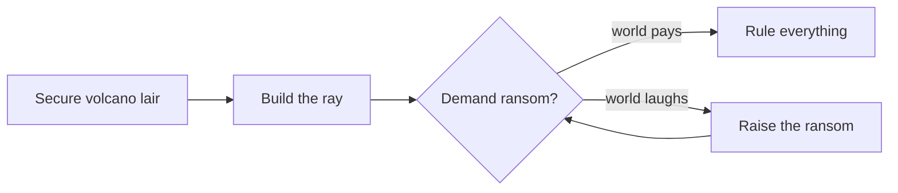

# How to Take Over the World 🌍

*A step-by-step plan. Results may vary. Cackling optional.*

You don't need a doctorate in evil — just good notes. Here's the plan, the budget, and the one ingredient every scheme forgets.

> [!WARNING]
> Do **not** monologue near the hero. This is how you lose. Every single time.

## The master plan

## Budget

| Line item | Cost | Status |
| --- | ---: | :---: |
| Volcano lair (pre-owned) | $4.2B | ✅ |
| Laser sharks (×6) | $900M | ✅ |
| Ominous cape | $85 | ⏳ |
| Henchman dental plan | $1.1M | ❌ |

## Ray output

The ray must exceed the planet's stubbornness $S$:

$$P_{\text{ray}} = \tfrac{1}{2}\,m\,c^{2} \;>\; S_{\text{Earth}}$$

## Remaining steps

- [x] Acquire lair
- [x] Recruit henchmen
- [ ] Learn to stop monologuing
- [ ] Write the plan in **Ouro MD** so the henchmen can actually read it

> *Only the last step has ever worked.*
